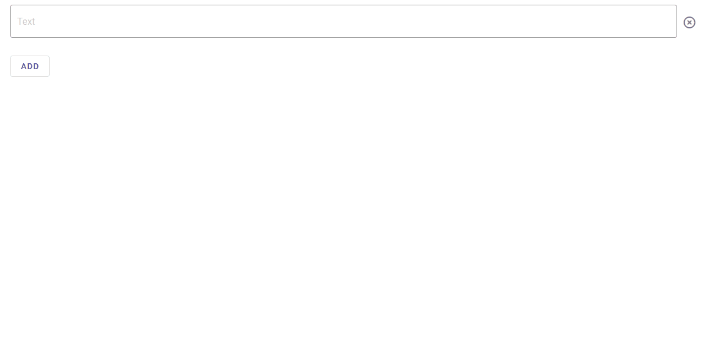

# VueJS Create dynamic component

> Create dynamic component when user click button



## Project setup

```
npm install
```

### Compiles and hot-reloads for development

```
npm run serve
```

## About

### Author

Tri Mulyanto  
Email: trimulyanto.tm@gmail.com
